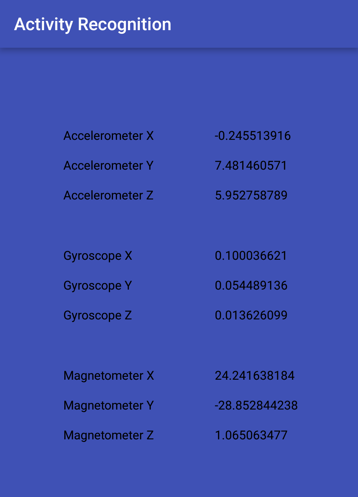

# Assignment 2.2

## Activity Recognition
This repository contains the source code for the Activity Recognition app with integration of accelerometer, gyroscope and magnetometer.

This app is created for an assignment of Programmable and Embedded Systems.

## Screenshots:

## Author

**Shashwat Gupta 14IE10028**