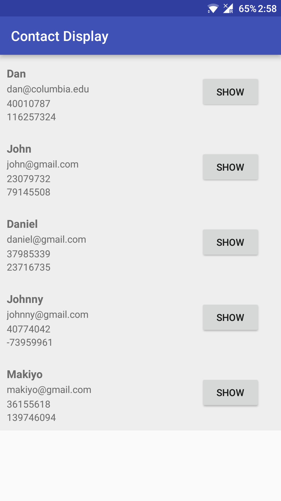

# Assignment 2.1

## Contact Display on Maps
This repository contains the source code for the Contact Display on Maps app with integration of Google Maps API.

This app is created for an assignment of Programmable and Embedded Systems.

## Screenshots:

## Author

**Shashwat Gupta 14IE10028**