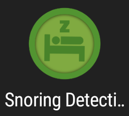
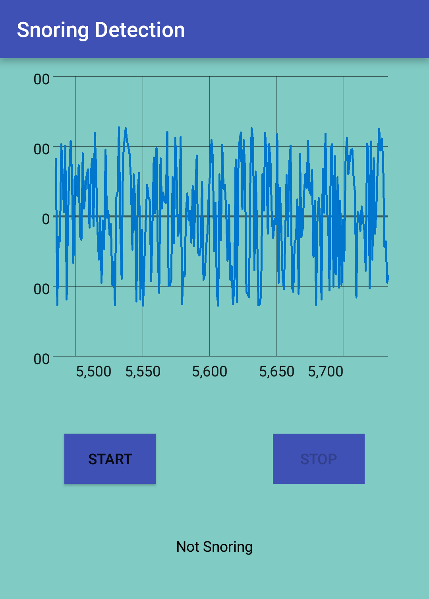
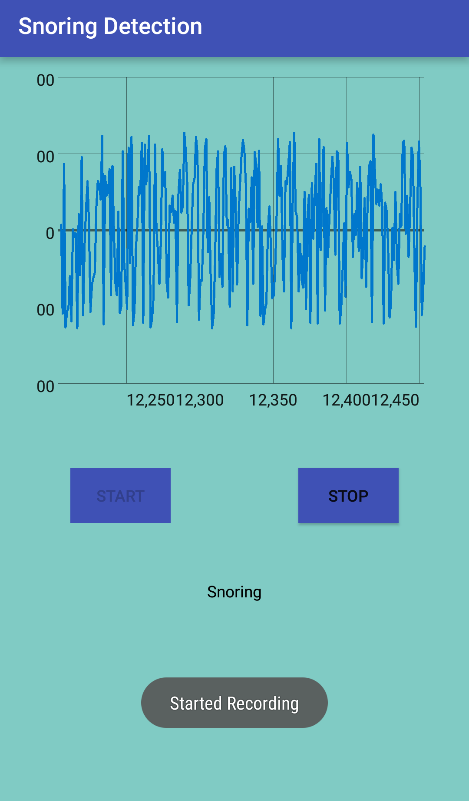
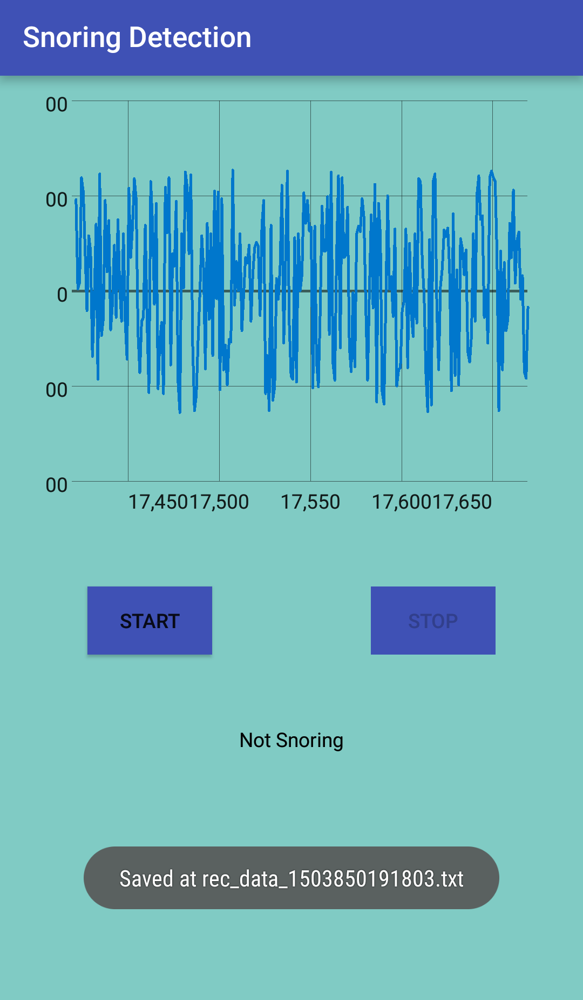

# Assignment 2.3

## Snoring Detection
This repository contains the source code for the Snoring Detection app with integration of voice recording.

This app is created for an assignment of Programmable and Embedded Systems.

## Screenshots:

## Author

**Shashwat Gupta 14IE10028**